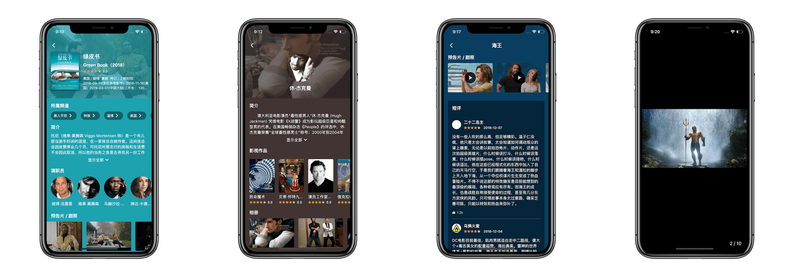
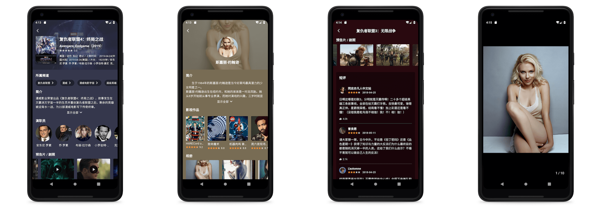

# Flutter Movie App

This is a very beautiful movie application which build by [flutter](https://flutter.dev/), use the [Douban](https://movie.douban.com/) public API. 

The project uses common layouts widget, such as Container, Stack, Column, Row, ListView, etc. It's very suitable for the freshman to practice. If you like this project, you can also give me a star, thank you so much!

Already completed:

- [x] hot article banner
- [x] popular movie
- [x] upcoming movie
- [x] category browsing
- [x] movie search
- [x] movie top list：top250、US box、weekly new
- [x] movie detail：introduction, stills, trailers, short reviews
- [x] actor detail：introduction, works, album
- [x] long press to save stills

To-do List:

- [ ] favorite movie

or scan the QR code:

**iOS：**  none for now

## Screenshot

### 1. Screenshot for iOS

 

### 2. Screenshot for Android

 

<!-- ## Document

The API used by the project has been organized into a markdown document:book:, press [API.md](https://github.com/Mayandev/morec/blob/master/API.md)。 -->

## Dependency

- [carousel_slider](https://pub.dartlang.org/packages/carousel_slider)
- [dio](https://pub.dartlang.org/packages/dio)
- [cached_network_image](https://pub.flutter-io.cn/packages/cached_network_image)
- [flutter_webview_plugin](https://pub.dartlang.org/packages/flutter_webview_plugin)
- [share](https://pub.dartlang.org/packages/share)
- [http](https://pub.dartlang.org/packages/http)
- [html](https://pub.dartlang.org/packages/html)
- [palette_generator](https://pub.dartlang.org/packages/palette_generator)
- [photo_view](https://pub.dartlang.org/packages/photo_view)
- [chewie](https://pub.dartlang.org/packages/chewie)
- [video_player](https://pub.dartlang.org/packages/video_player)
